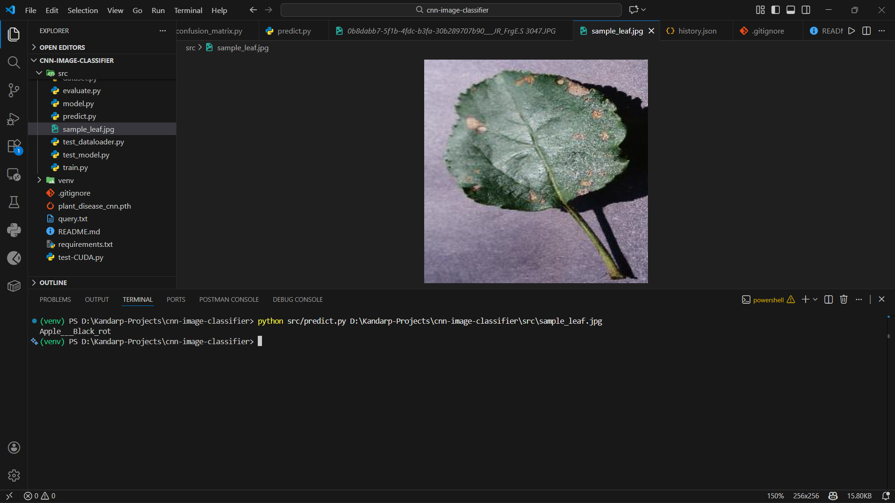
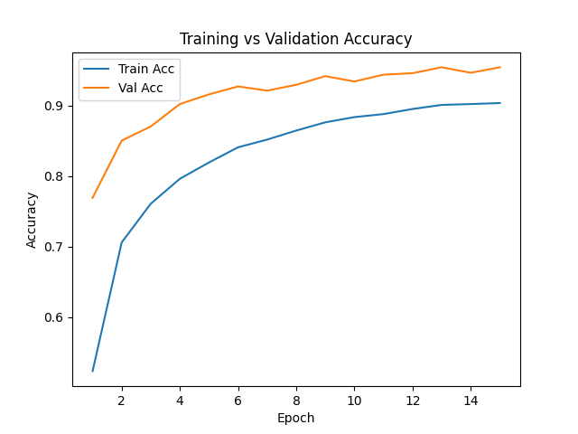
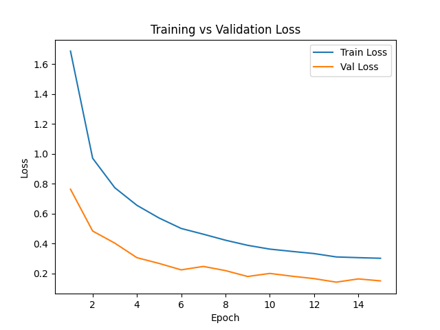
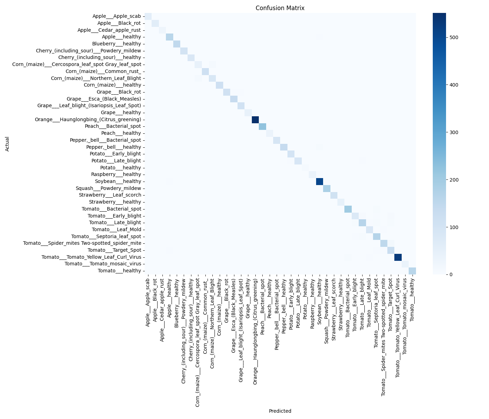

# 🌱 Plant Disease Detection using CNN (PyTorch)

## 📌 Overview

This project implements a **Convolutional Neural Network (CNN) from scratch using PyTorch** to classify plant leaf diseases across  **38 categories** .
The goal is to build a **complete deep learning pipeline** — from data preprocessing to model training, evaluation, and inference — while gaining a strong understanding of CNN internals and GPU-accelerated training.

The model is trained on the **PlantVillage (color images)** dataset and achieves  **~94% validation accuracy** , demonstrating strong generalization on unseen data.

---

## 🎯 Problem Statement

Early detection of plant diseases is critical for improving crop yield and reducing agricultural losses. Manual inspection is time-consuming and error-prone.
This project explores how **computer vision and deep learning** can be used to automatically identify plant diseases from leaf images.

---

## 🧠 Key Highlights

* ✅ CNN **built entirely from scratch** (no pretrained models)
* ✅ End-to-end ML pipeline (data → training → evaluation → inference)
* ✅ GPU-accelerated training using **CUDA**
* ✅ Proper **train / validation / test** split
* ✅ Data augmentation to improve generalization
* ✅ Detailed evaluation with metrics and visualizations
* ✅ Clean, modular, and professional project structure

---

## 📂 Project Structure

```
cnn-image-classifier/
│
├── data/
│   ├── raw/                 # Original dataset
│   └── processed/           # Train / Val / Test splits
│
├── src/
│   ├── dataset.py           # Data loaders & transforms
│   ├── model.py             # CNN architecture
│   ├── train.py             # Training loop
│   ├── evaluate.py          # Test evaluation
│   └── predict.py           # Inference script
│
├── experiments/
│   ├── history.json         # Training metrics
│   ├── loss_curve.png       # Loss plot
│   ├── accuracy_curve.png   # Accuracy plot
│   └── confusion_matrix.png # Confusion matrix
│
├── scripts/
│   └── split_dataset.py     # Dataset splitting script
│
├── requirements.txt
└── README.md
```

---

## 📊 Dataset

* **Source:** PlantVillage Dataset (Color Images)
* **Classes:** 38 (healthy + diseased plant leaves)
* **Image Size:** Resized to 224 × 224
* **Splits:**
  * Train: 70%
  * Validation: 20%
  * Test: 10%

Only **color images** are used to better reflect real-world conditions.

---

## 🔄 Data Preprocessing & Augmentation

**Training data:**

* Resize to 224 × 224
* Random horizontal flip
* Random rotation
* Color jitter
* Normalization (ImageNet mean & std)

**Validation & Test data:**

* Resize
* Normalization only
  (No augmentation to ensure fair evaluation)

---

## 🧱 Model Architecture

* 3 Convolutional blocks
  *(Conv → ReLU → MaxPooling)*
* Fully connected classifier
* Dropout for regularization

**Why from scratch?**
To deeply understand:

* Feature extraction
* Tensor shapes
* CNN internals
* Training dynamics

---

## ⚙️ Training Details

* **Framework:** PyTorch
* **Optimizer:** Adam
* **Loss Function:** CrossEntropyLoss
* **Batch Size:** 32
* **Epochs:** 15
* **Hardware:** GPU (CUDA enabled)

---

## 📈 Results

| Metric              | Value    |
| ------------------- | -------- |
| Train Accuracy      | ~89%     |
| Validation Accuracy | ~94%     |
| Test Accuracy       | ~92–94% |

### Visualizations

* Training vs Validation Loss Curve
* Training vs Validation Accuracy Curve
* Confusion Matrix (class-wise performance)

---

## 🧠 Error Analysis

Most misclassifications occur between  **visually similar diseases** , such as different tomato leaf infections.
This behavior is expected due to overlapping color and texture patterns and indicates realistic model behavior rather than overfitting.

---

## 🚀 Inference (Prediction on New Images)

You can predict the disease class for a new leaf image:

```bash
python src/predict.py <image-path>
```

The script loads the trained model and outputs the predicted disease class.



---

## 🏃 How to Run the Project

### 1️⃣ Install dependencies

```bash
pip install -r requirements.txt
```

### 2️⃣ Train the model

```bash
python src/train.py
```

### 3️⃣ Evaluate on test set

```bash
python src/evaluate.py
```

### 4️⃣ Generate plots

```bash
python experiments/plot_metrics.py
python experiments/plot_confusion_matrix.py
```

---

## Accuracy




## Loss Curve




## Confusion Matrix



## 📚 Learnings & Takeaways

* Built a CNN **from first principles**
* Understood the importance of data augmentation
* Learned how to manage tensor dimensions in CNNs
* Implemented clean training & validation workflows
* Gained hands-on experience with GPU training in PyTorch
* Learned how to analyze model errors and performance

---


## 🧑‍💻 Author

**Kandarp Joshi** AI & Data Science Developer

🌐 Github: [@Kandarp Joshi](https://github.com/KandarpJoshi1112) 🔗 LinkedIn: [@Kandarp Joshi](https://www.linkedin.com/in/kandarp-joshi-3451231bb/)
